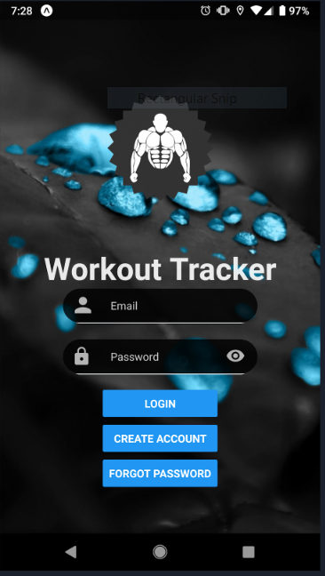
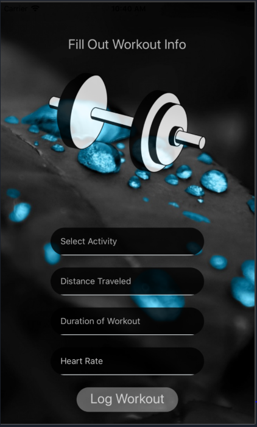

# Exercise Tracker
> by 2TicketToParadise
## An app designed to help you track your workout progress.
This app is designed to help you track your workouts. 
You can track your workouts in two categories; weights and cardio. 
You can see all of you previous workouts in the tracker screen.
<p>
 

</p>
### Repo	Organization
All of the main screens are in the screens folder and the links to both the authorization database 
and the workout database can be found in the constants folder. This is where you can add your on databases
to make the app your own. The Navigation folder is where you can make changes to the way the app navigates. 
Add your own images in the assets folder and the heart of the app is in the App.js file

### 	How to Build/Run/Test the App

#### Installation

Clone this repo
```
$ git clone https://github.com/2TicketsToParadise/2TicketsProject.git
$ cd 2TicketsProject
$ yarn install or npm install
```

Add Your Own Database API Keys
- in constants/APIkeys add your Firebase database information: 
```
FirebaseConfig: {
        apiKey: " ",
        authDomain: " ",
        databaseURL: " ",
        projectId: " ",
        storageBucket: " ",
        messagingSenderId: " ",
  }
```
- in constants/dbCalls add your Postgress database for the workout tracking:
```
return fetch('<Your Database Address Here>'
```

#### How To Start

```
$ expo start
```

Finally wait for the QR code  to show and scan it with your Expo app and Enjoy!

Thanks, 

2TicketsToParadise
